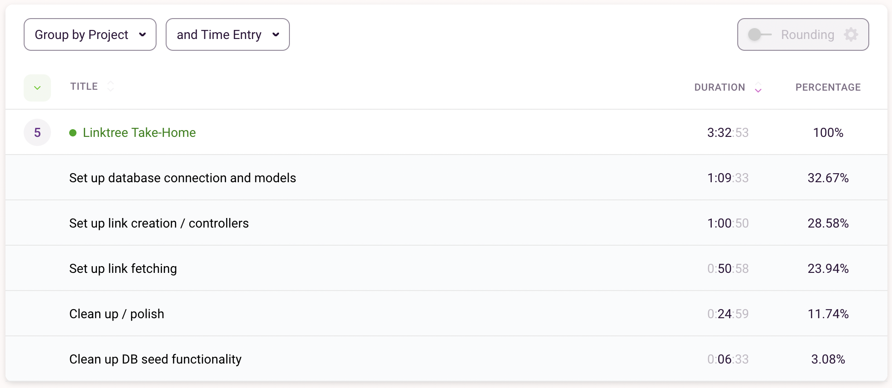

## Thanks for your consideration! :)

# Time Breakdown

  

I thought it would be interesting (and informative for you) to track my time spent on different tasks with [Toggl](https://toggl.com/track/). It also shows where I landed between the 3 and 4 hour mark that was suggested.

# Running This Project
1. Install [NodeJS](https://nodejs.org/en/) and [MongoDB Community Server](https://www.mongodb.com/try/download/community) if you don't have them already. I would also encourage [MongoDB Compass](https://www.mongodb.com/products/compass) for more easily observing data changes.
2. After cloning the project, copy the contents of `.env.sample` into a new file called `.env`, which also needs to be in the root project directory.
3. Run `npm install`.
4. Run `npm start`.
5. I recommend using Postman to make requests to `localhost:3000` in order to interact with the API. I've gone ahead and made a [Postman Collection](https://www.getpostman.com/collections/ac9a8227c624dc1685d5) that you can import to easily test the API endpoints. This collection includes:
	- GET all links based on `userId` (optional `dateCreated` sort)
	- POST (create) a Classic link.
	- POST (create) a Music link.
	- POST (create) a Showlist link.
	- POST (register) a User.

Enjoy!

  

# The Problem
We have three new link types for our users.

1. Classic
	- Titles can be no longer than 144 characters.
	- Some URLs will contain query parameters, some will not.
2. Shows List
	- One show will be sold out.
	- One show is not yet on sale.
	- The rest of the shows are on sale.
3. Music Player
	- Clients will need to link off to each individual platform.
	- Clients will embed audio players from each individual platform.
	
You are required to create a JSON API that our front end clients will interact with.

- The API can be GraphQL or REST.
- The API can be written in your preferred language.
- The client must be able to create a new link of each type.
- The client must be able to find all links matching a particular userId.
- The client must be able to find links matching a particular userId, sorted by dateCreated.

## Your Solution

- Consider bad input data and the end user of your API - we're looking for good error handling and input validation.
- If you are creating a GraphQL API, think about the access patterns the client may use, and think about the acces patterns the client may not use. Try not to [Yak Shave](https://seths.blog/2005/03/dont_shave_that/)
- Consider extensibility, these are 3 of hundreds of potential link types that we will be developing.

## Rules & Tips

- Choose the language and environment of your choice, just include documentation on how to run your code.
- Immutability and functional programming is looked upon favorably.
- You cannot connect to a real world database - document your schema design.
- Mocking third parties is looked upon favorably.
- @todo comments are encouraged. You aren't expected to complete the challenge, but how you design your solution and your ideas for the future are important.

---
# Submission
Set up your own remote git repository and make commits as you would in your day to day work. Submit a link to your repo when you're finished.
